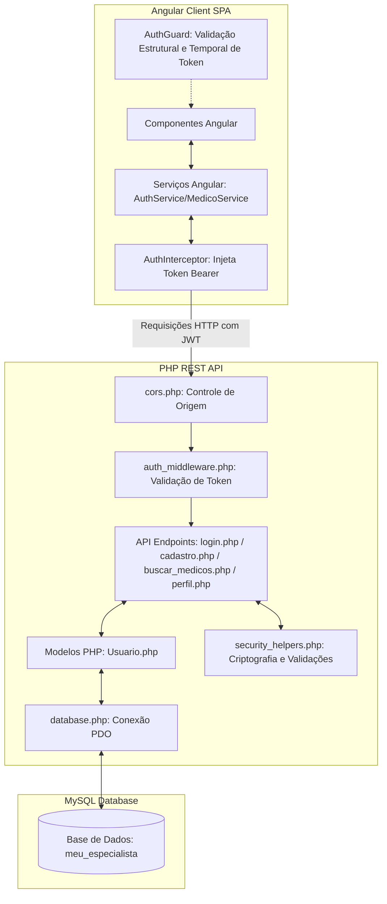

# MeuEspecialista — Análise de Arquitetura e Implementação Técnica

Este documento apresenta uma revisão técnica detalhada e estruturada do projeto **MeuEspecialista**. Ele serve como material de apoio técnico, demonstrando o rigor técnico, os padrões de projeto (Design Patterns) aplicados, as boas práticas de engenharia de software e as implementações robustas de segurança adotadas nas camadas de frontend e backend.

---

## 1. Visão Geral da Arquitetura

O **MeuEspecialista** adota a arquitetura de **Sistemas Distribuídos desacoplados** (Client-Server Architecture) baseando-se em:
*   **Frontend**: Uma aplicação SPA (Single Page Application) rica construída com **Angular (v17+)**.
*   **Backend**: Uma **API RESTful nativa em PHP**, que processa as requisições HTTP e serve dados estruturados em formato **JSON**.
*   **Banco de Dados**: Sistema de Gerenciamento de Banco de Dados Relacional **MySQL** acessado via **PDO (PHP Data Objects)**.



---

## 2. Camada Frontend: Angular SPA

O frontend foi projetado sob os conceitos modernos do ecossistema Angular, destacando-se pela modularidade e tipagem estrita com TypeScript.

### Principais Destaques do Frontend:
*   **Componentes Standalone**: Utilização de `standalone: true` (como visto no componente `Buscar`), permitindo componentes autocontidos com dependências explícitas (`imports: [CommonModule, FormsModule, RouterModule]`), o que reduz o overhead de carregamento e melhora o tree-shaking.
*   **Ciclo de Vida do Componente**: Inicialização e carregamento assíncrono de dados no gancho `ngOnInit` (ex. disparo da busca inicial de médicos).
*   **Validação de Formulários no Cliente**:
    *   **CPF**: Implementação local do algoritmo matemático oficial de 11 dígitos com cálculo de dois dígitos verificadores antes do envio do formulário de cadastro ou perfil.
    *   **CRM**: Validação via expressões regulares (regex) para aceitar formatos corretos (4 a 10 dígitos seguido opcionalmente por hífen, barra ou espaço e o estado, ex: `12345/SP`).
*   **Interceptação Centralizada de Requisições (`AuthInterceptor`)**:
    *   Implementa `HttpInterceptor` para capturar todas as saídas de requisições HTTP de forma transparente.
    *   Injeta automaticamente o cabeçalho `Authorization: Bearer <TOKEN>` caso o usuário esteja autenticado, garantindo a segurança de rotas restritas sem duplicar lógica de código.
*   **Proteção de Rotas (`AuthGuard`)**:
    *   Uso de um guarda de rotas implementando `canActivate`, impedindo que usuários não autenticados acessem áreas privadas como `/perfil` e `/buscar`.
    *   **Validação do Token no Cliente**: O `AuthGuard` agora decodifica o payload base64 do JWT local e verifica o campo de expiração (`exp`). Caso expirado ou adulterado, realiza logout automático limpando o `localStorage`.
*   **Comunicação Reativa**: Uso de **RxJS (`Observable`)** para manipular fluxos assíncronos de chamadas à API, permitindo tratamento limpo de respostas (`next`) e falhas (`error`), bem como gerenciamento dinâmico do estado de carregamento (`carregando: boolean`).

---

## 3. Camada Backend: PHP REST API

O backend é leve, rápido e estruturado para seguir as melhores práticas de tratamento de erros e segurança de dados.

### Principais Destaques do Backend:
*   **Segurança Criptográfica (Hashing de Senhas)**:
    *   Utilização do algoritmo robusto **bcrypt** por meio da função nativa `password_hash($senha, PASSWORD_DEFAULT)` no cadastro.
    *   Verificação segura com `password_verify($senha, $row['senha'])`, evitando o armazenamento de senhas em texto puro e protegendo o sistema contra vazamento de credenciais.
*   **Criptografia Simétrica de Dados Sensíveis (LGPD Compliance)**:
    *   Campos sensíveis no banco de dados como **CPF**, **CRM** e **Telefone** são armazenados criptografados usando o algoritmo **AES-256-CBC** com chave de 256 bits configurada centralizadamente.
    *   **Criptografia Determinística**: Para o **CPF** e **CRM**, é usada criptografia com IV estático (derivado). Isso garante que o mesmo valor resulte no mesmo texto cifrado, preservando as restrições de unicidade (`UNIQUE`) e permitindo consultas seguras por chave única no MySQL.
    *   **Criptografia Dinâmica**: Para o **Telefone**, é usado um IV aleatório (`openssl_random_pseudo_bytes`), garantindo a máxima confidencialidade para o mesmo número de telefone repetido em cadastros diferentes.
    *   **Descriptografia Dinâmica**: As APIs descriptografam esses dados ao alimentar o perfil do usuário ou a listagem e busca de médicos.
*   **Prevenção contra Injeção de SQL (SQL Injection)**:
    *   Uso estrito de **Prepared Statements** com a extensão **PDO** (PHP Data Objects).
    *   Toda variável vinda do cliente é tratada via `bindParam` (ex. `:email`, `:nome`, `:tipo`), eliminando qualquer possibilidade de injeção de comandos maliciosos no MySQL.
*   **Transações de Banco de Dados (Database Transactions)**:
    *   No script de cadastro (`cadastro.php`), para garantir a integridade dos dados, é usada a transação do banco de dados:
        ```php
        $db->beginTransaction();
        // ... insere na tabela usuarios ...
        // ... insere na tabela medicos_perfil ou pacientes_perfil ...
        $db->commit();
        ```
    *   Caso ocorra qualquer erro em qualquer uma das etapas, o bloco `catch` executa um `$db->rollBack()`, prevenindo registros órfãos ou inconsistências nas chaves estrangeiras.
*   **CORS Centralizado (`cors.php`)**:
    *   Estrutura robusta que valida a origem da requisição dinâmica, lidando corretamente com requisições de pré-vôo (**Preflight OPTIONS**), permitindo a comunicação local suave com o frontend em `http://localhost:4200` e habilitando credenciais com segurança.

---

## 4. Mecanismo de Autenticação Stateful-Stateless (JWT Customizado)

Uma das maiores qualidades arquiteturais do projeto é o sistema de **autenticação sem estado (stateless)** baseado em tokens autoassinados baseados nos princípios do padrão **JWT (JSON Web Token)**:

1.  **Geração do Token (`login.php`)**:
    *   Gera um payload contendo informações básicas (`id`, `email`, `tipo` e tempo de expiração `exp`).
    *   Faz o encode do payload em Base64.
    *   Gera uma assinatura segura do payload codificado usando o algoritmo `HMAC-SHA256` com uma chave secreta (`JWT_SECRET`).
    *   O token final é composto por: `<PAYLOAD_BASE64>.<ASSINATURA_HMAC>`.
2.  **Validação do Token (`auth_middleware.php`)**:
    *   O middleware intercepta a requisição, lê o cabeçalho `Authorization: Bearer <TOKEN>`.
    *   Separa o payload da assinatura enviada.
    *   Gera uma nova assinatura esperada baseada no payload recebido e no `JWT_SECRET` local.
    *   Se as assinaturas forem idênticas, garante-se que o token não foi adulterado no meio do caminho.
    *   Verifica se o token expirou (`$dados->exp < time()`).

---

## 5. Pontos Fortes e Rigor Acadêmico para Apresentar ao Orientador

Ao conversar com seu orientador, você pode destacar estes **argumentos de peso**:
1.  **Arquitetura Baseada em Separação de Responsabilidades (SoC - Separation of Concerns)**: O frontend cuida estritamente da renderização e experiência do usuário, enquanto o backend atua como um provedor de dados puro (Stateless API), aumentando a manutenibilidade.
2.  **Conformidade com Privacidade de Dados (LGPD/Security by Design)**: Em vez de armazenar dados pessoais (CPF, telefone, CRM) em texto puro, o projeto implementa criptografia simétrica avançada com diferentes estratégias de IV (vetores de inicialização estáticos e aleatórios).
3.  **Integridade de Dados Relacionais**: A divisão entre perfis (`medicos_perfil` e `pacientes_perfil`) estendendo a tabela comum `usuarios` com o uso de transações e controle manual de erros de chaves únicas/duplicidades no backend demonstra maturidade técnica.
4.  **Validações em Camada Dupla**: Implementação do algoritmo matemático oficial de 11 dígitos do CPF e filtros estruturados para CRM no cliente e no servidor de forma redundante para segurança e melhor experiência do usuário.
